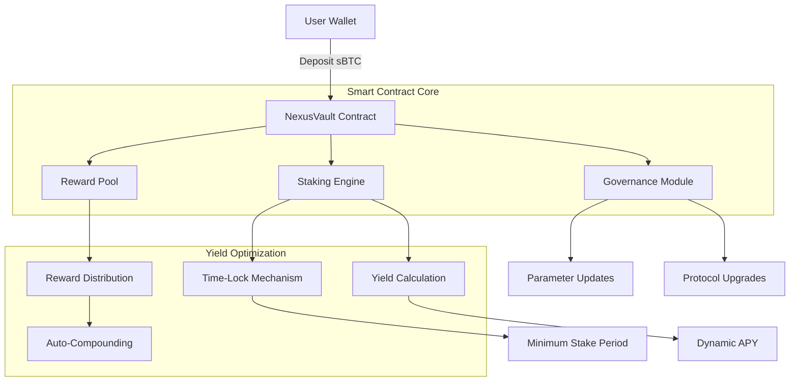

# NexusVault Protocol 🚀

**Advanced Bitcoin Yield Aggregation Engine**

[](https://clarity-lang.org/)
[](LICENSE)
[](https://github.com/sodiq-abaraojo/nexus-vault)

> *Transforming dormant sBTC holdings into high-yield earning assets through algorithmic staking pools and automated reward compounding.*

---

## 📋 Table of Contents

- [Overview](#overview)
- [Architecture](#architecture)
- [Key Features](#key-features)
- [Smart Contract Functions](#smart-contract-functions)
- [Installation & Setup](#installation--setup)
- [Usage Guide](#usage-guide)
- [Testing](#testing)
- [Security Considerations](#security-considerations)
- [Tokenomics](#tokenomics)
- [Roadmap](#roadmap)
- [Contributing](#contributing)
- [License](#license)

---

## 🌟 Overview

NexusVault Protocol is a cutting-edge DeFi platform built on the Stacks blockchain that establishes a premier staking ecosystem powered by Bitcoin Layer 2 technology. The protocol enables users to deposit synthetic Bitcoin (sBTC) into algorithmically-managed yield vaults that automatically optimize returns through intelligent time-lock mechanisms.

### Core Value Proposition

- **🔒 Capital Security**: Risk-optimized vault strategies preserve capital while maximizing productivity
- **📈 Dynamic Yields**: Algorithmic staking pools with adaptive reward distribution
- **⚡ Auto-Compounding**: Automated reward optimization that responds to market dynamics
- **🏛️ Decentralized Governance**: Community-driven protocol upgrades and parameter adjustments
- **🔧 Customizable Locks**: Flexible staking periods for different risk appetites

---

## 🏗️ Architecture

### System Overview



### Contract Architecture

The NexusVault smart contract is organized into several logical modules:

#### 1. **Core Data Structures**

```clarity
;; User staking positions with timestamp tracking
(define-map stakes
  { staker: principal }
  { amount: uint, staked-at: uint }
)

;; Historical reward claims for transparency
(define-map rewards-claimed
  { staker: principal }
  { amount: uint }
)
```

#### 2. **Protocol Configuration**

- **Reward Rate**: Dynamic APY management in basis points
- **Reward Pool**: Treasury for staking rewards distribution
- **Minimum Stake Period**: Risk management through time-locks
- **Total Staked**: Protocol-wide liquidity tracking

#### 3. **Governance Layer**

- Owner-based administrative functions
- Configurable parameters (reward rates, lock periods)
- Transparent ownership transfer mechanisms

#### 4. **Yield Engine**

- Time-weighted reward calculations
- Automatic compounding mechanisms
- Dynamic APY adjustments based on market conditions

---

## ✨ Key Features

### 🎯 **Intelligent Staking Pools**

- Algorithmic optimization of staking rewards
- Dynamic adjustment based on pool utilization
- Risk-adjusted returns with customizable time-locks

### 💰 **Automated Reward Compounding**

- Seamless reward claiming without unstaking principal
- Auto-reinvestment strategies for maximum yield
- Gas-optimized compound transactions

### 🔐 **Security-First Design**

- Multi-layered authorization checks
- Time-lock protections against early unstaking
- Comprehensive error handling and validation

### 📊 **Real-Time Analytics**

- Live protocol statistics and performance metrics
- Individual staking position tracking
- Historical reward distribution transparency

### 🏛️ **Decentralized Governance**

- Community-controlled parameter adjustments
- Transparent ownership and upgrade mechanisms
- Stakeholder voting on protocol improvements

---

## 🔧 Smart Contract Functions

### Administrative Functions

| Function | Description | Access |
|----------|-------------|---------|
| `set-contract-owner` | Transfer protocol ownership | Owner Only |
| `set-reward-rate` | Update APY parameters | Owner Only |
| `set-min-stake-period` | Adjust minimum lock time | Owner Only |
| `add-to-reward-pool` | Fund reward treasury | Public |

### Core Staking Functions

| Function | Description | Returns |
|----------|-------------|---------|
| `stake` | Deposit sBTC for yield generation | `(response bool uint)` |
| `unstake` | Withdraw staked sBTC + rewards | `(response bool uint)` |
| `claim-rewards` | Harvest rewards without unstaking | `(response bool uint)` |
| `calculate-rewards` | Preview pending rewards | `uint` |

### Read-Only Functions

| Function | Description | Returns |
|----------|-------------|---------|
| `get-stake-info` | User staking position details | `(optional {amount: uint, staked-at: uint})` |
| `get-protocol-stats` | Comprehensive protocol metrics | `{total-staked: uint, reward-pool: uint, ...}` |
| `get-current-apy` | Real-time APY calculation | `uint` |
| `get-total-staked` | Protocol-wide TVL | `uint` |

---

## 🚀 Installation & Setup

### Prerequisites

- [Node.js](https://nodejs.org/) (v18+)
- [Clarinet](https://github.com/hirosystems/clarinet) CLI
- [Git](https://git-scm.com/)

### Quick Start

1. **Clone the Repository**

   ```bash
   git clone https://github.com/sodiq-abaraojo/nexus-vault.git
   cd nexus-vault
   ```

2. **Install Dependencies**

   ```bash
   npm install
   ```

3. **Initialize Clarinet Environment**

   ```bash
   clarinet check
   ```

4. **Run Development Tests**

   ```bash
   npm test
   ```

### Development Environment

```bash
# Start Clarinet console for interactive testing
clarinet console

# Check contract syntax and deploy locally
clarinet check

# Generate test coverage report
npm run test:report

# Watch mode for continuous testing
npm run test:watch
```

---

## 📚 Usage Guide

### Basic Staking Workflow

#### 1. **Stake sBTC Tokens**

```clarity
;; Stake 1000 sBTC (1000000000 microBTC)
(contract-call? .nexus-vault stake u1000000000)
```

#### 2. **Monitor Rewards**

```clarity
;; Check pending rewards
(contract-call? .nexus-vault calculate-rewards tx-sender)

;; View stake information
(contract-call? .nexus-vault get-stake-info tx-sender)
```

#### 3. **Claim Rewards**

```clarity
;; Harvest rewards without unstaking
(contract-call? .nexus-vault claim-rewards)
```

#### 4. **Unstake Position**

```clarity
;; Withdraw 500 sBTC after minimum lock period
(contract-call? .nexus-vault unstake u500000000)
```

### Advanced Usage

#### Protocol Statistics

```clarity
;; Get comprehensive protocol metrics
(contract-call? .nexus-vault get-protocol-stats)
;; Returns: {total-staked: uint, reward-pool: uint, reward-rate: uint, ...}
```

#### Governance Operations (Owner Only)

```clarity
;; Update reward rate to 1% APY (100 basis points)
(contract-call? .nexus-vault set-reward-rate u100)

;; Set minimum stake period to 30 days (~4320 blocks)
(contract-call? .nexus-vault set-min-stake-period u4320)
```

---

## 🧪 Testing

### Test Structure

```
tests/
├── nexus-vault.test.ts          # Core functionality tests
├── integration/                 # End-to-end testing
├── security/                    # Security vulnerability tests
└── performance/                 # Gas optimization tests
```

### Running Tests

```bash
# Run all tests
npm test

# Generate coverage report
npm run test:report

# Continuous testing during development
npm run test:watch

# Clarinet-specific contract checks
clarinet check
```

### Test Categories

- **Unit Tests**: Individual function validation
- **Integration Tests**: End-to-end staking workflows
- **Security Tests**: Authorization and edge case validation
- **Performance Tests**: Gas cost optimization verification

---

## 🔒 Security Considerations

### Smart Contract Security

#### **Access Control**

- Owner-only administrative functions
- Transaction sender validation
- State modification protections

#### **Economic Security**

- Minimum staking period enforcement
- Reward pool sufficiency checks
- Integer overflow/underflow protection

#### **Operational Security**

- Comprehensive error handling
- State consistency validation
- Reentrancy attack prevention

### Audit Status

| Component | Status | Last Updated |
|-----------|--------|--------------|
| Core Contract | ⏳ Pending | 2025-07-18 |
| Governance | ⏳ Pending | 2025-07-18 |
| Reward Engine | ⏳ Pending | 2025-07-18 |

### Known Considerations

1. **Oracle Dependency**: Future versions may integrate price oracles for dynamic yield optimization
2. **Governance Risks**: Initial centralized ownership transitioning to DAO governance
3. **Smart Contract Risk**: Standard DeFi protocol risks apply

---

## 💎 Tokenomics

### Reward Mechanism

| Parameter | Value | Description |
|-----------|-------|-------------|
| **Base APY** | 5% (50 bp) | Initial reward rate |
| **Minimum Lock** | 10 days (~1440 blocks) | Minimum staking period |
| **Reward Token** | sBTC | Native Bitcoin rewards |
| **Compounding** | Automatic | Seamless reinvestment |

### Economic Model

- **Staking Rewards**: Time-weighted yield distribution
- **Dynamic Rates**: Market-responsive APY adjustments
- **Auto-Compounding**: Maximized capital efficiency
- **Governance Incentives**: Future token-based voting rights

---

## 🗓️ Roadmap

### Phase 1: Core Protocol (Current)

- ✅ Basic staking and unstaking functionality
- ✅ Reward calculation and distribution
- ✅ Administrative governance functions
- ✅ Comprehensive testing suite

### Phase 2: Advanced Features (Q3 2025)

- 🔄 Multi-tier staking pools with different risk/reward profiles
- 🔄 Dynamic APY based on pool utilization
- 🔄 Emergency pause and upgrade mechanisms
- 🔄 Advanced analytics dashboard

### Phase 3: DeFi Integration (Q4 2025)

- 📋 Cross-protocol yield farming integrations
- 📋 Automated strategy execution
- 📋 Institutional staking features
- 📋 Mobile application interface

### Phase 4: Governance & Scaling (Q1 2026)

- 📋 Full DAO governance implementation
- 📋 Multi-chain expansion planning
- 📋 Professional institutional features
- 📋 Enterprise-grade security audits

---

## 🤝 Contributing

We welcome contributions from the Stacks and DeFi community!

### Development Guidelines

1. **Fork & Clone**: Create your feature branch
2. **Code Standards**: Follow Clarity best practices
3. **Testing**: Ensure comprehensive test coverage
4. **Documentation**: Update relevant documentation
5. **Pull Request**: Submit for community review

### Contribution Areas

- 🐛 **Bug Fixes**: Security vulnerabilities and edge cases
- ✨ **Features**: New protocol functionality
- 📖 **Documentation**: Technical and user guides
- 🧪 **Testing**: Expanded test coverage
- 🎨 **UX/UI**: Frontend interface improvements

### Getting Started

```bash
# Fork repository and clone locally
git clone https://github.com/your-username/nexus-vault.git

# Create feature branch
git checkout -b feature/amazing-improvement

# Make changes and test
npm test

# Submit pull request
git push origin feature/amazing-improvement
```

---

## 📄 License

This project is licensed under the **MIT License** - see the [LICENSE](LICENSE) file for details.

---

### Stacks Ecosystem

- [Stacks Blockchain](https://stacks.org/)
- [Clarity Language](https://clarity-lang.org/)
- [sBTC Documentation](https://docs.stacks.org/sbtc)
- [Clarinet Testing Framework](https://github.com/hirosystems/clarinet)
